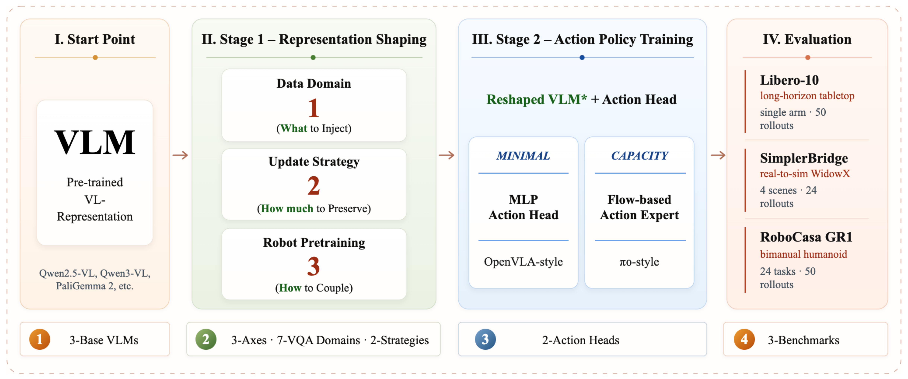

# Rethinking VLM Representation for VLA Initialization


## Overview

This paper studies VLA initialization as a controlled representation-design problem along three axes: capability-level embodied VQA supervision, parameter-update strategy, and robot-data pretraining. [[arXiv]](https://arxiv.org/pdf/2605.25802)

<p align="center">
  
</p>

Key findings:

- The original pretrained VLM representation is a major source of action performance (>20% drop when training from scratch).
- Embodied VQA adaptation is conditionally useful: its benefit depends on the downstream bottleneck.
- LoRA provides a more reliable initialization than Full Finetune — overly reshaping the pretrained representation weakens VLA initialization.
- The best initialization follows a staged route: adapt with {Grounding + Egocentric Understanding}, then continue with LoRA-based robot-data pretraining.

## Main Results

All numbers are success rates (%) averaged over 3 evaluation seeds.

### Table 1: Single-Domain VQA Adaptation

> Effect of adapting the VLM with a single embodied VQA domain before VLA training.

<table>
<thead>
<tr>
<th rowspan="2">Domain</th>
<th colspan="3" align="center">MLP Head (OFT)</th>
<th colspan="3" align="center">Diffusion Expert (PI)</th>
</tr>
<tr>
<th align="center">Libero-10</th>
<th align="center">SimplerBridge</th>
<th align="center">RoboCasa</th>
<th align="center">Libero-10</th>
<th align="center">SimplerBridge</th>
<th align="center">RoboCasa</th>
</tr>
</thead>
<tbody>
<tr><td><i>Train from scratch</i></td><td align="center">66.6</td><td align="center">19.4</td><td align="center">20.3</td><td align="center">68.6</td><td align="center">28.9</td><td align="center">30.1</td></tr>
<tr><td>Baseline (pretrained VLM)</td><td align="center">92.4</td><td align="center"><b>45.8</b></td><td align="center">49.5</td><td align="center">91.8</td><td align="center">50.5</td><td align="center">51.7</td></tr>
<tr><td colspan="7"></td></tr>
<tr><td>Spatial</td><td align="center">93.0</td><td align="center">41.4</td><td align="center">49.2</td><td align="center">92.4</td><td align="center">49.9</td><td align="center">50.0</td></tr>
<tr><td><b>Grounding</b></td><td align="center"><b>95.6</b></td><td align="center">44.8</td><td align="center"><b>50.4</b></td><td align="center"><b>94.2</b></td><td align="center"><b>50.8</b></td><td align="center"><b>52.7</b></td></tr>
<tr><td>Plan & Reasoning</td><td align="center">95.2</td><td align="center">37.8</td><td align="center">47.5</td><td align="center">92.8</td><td align="center">48.1</td><td align="center">51.1</td></tr>
<tr><td>Camera Prediction</td><td align="center">93.2</td><td align="center">43.0</td><td align="center">47.9</td><td align="center">92.6</td><td align="center">46.6</td><td align="center">50.7</td></tr>
<tr><td>Ego Understanding</td><td align="center">95.3</td><td align="center">43.2</td><td align="center">49.9</td><td align="center">93.0</td><td align="center">49.8</td><td align="center">52.0</td></tr>
<tr><td>Temporal</td><td align="center"><b>96.4</b></td><td align="center">38.2</td><td align="center">47.9</td><td align="center">93.1</td><td align="center">49.1</td><td align="center">50.7</td></tr>
<tr><td>Action-NTP</td><td align="center">95.4</td><td align="center">44.0</td><td align="center">50.0</td><td align="center">93.4</td><td align="center">49.6</td><td align="center">52.3</td></tr>
</tbody>
</table>

### Table 2: Domain Composition

> Combining multiple VQA domains.

<table>
<thead>
<tr>
<th rowspan="2">Configuration</th>
<th colspan="2" align="center">MLP Head (OFT)</th>
<th colspan="2" align="center">Diffusion Expert (PI)</th>
</tr>
<tr>
<th align="center">Libero-10</th>
<th align="center">RoboCasa</th>
<th align="center">Libero-10</th>
<th align="center">RoboCasa</th>
</tr>
</thead>
<tbody>
<tr><td><i>Grounding</i></td><td align="center">95.6</td><td align="center">50.4</td><td align="center">94.2</td><td align="center">52.7</td></tr>
<tr><td><i>Ego Understanding</i></td><td align="center">95.3</td><td align="center">49.9</td><td align="center">93.0</td><td align="center">52.0</td></tr>
<tr><td><i>Action-NTP</i></td><td align="center">95.4</td><td align="center">50.0</td><td align="center">93.4</td><td align="center">52.3</td></tr>
<tr><td colspan="5"></td></tr>
<tr><td><b>Grounding + Ego</b></td><td align="center"><b>95.7</b></td><td align="center"><b>51.5</b></td><td align="center"><b>95.8</b></td><td align="center"><b>53.5</b></td></tr>
<tr><td>Grounding + Action-NTP</td><td align="center">95.2</td><td align="center">50.6</td><td align="center">94.5</td><td align="center">51.9</td></tr>
<tr><td>Ego + Action-NTP</td><td align="center">95.0</td><td align="center">50.2</td><td align="center">94.8</td><td align="center">51.7</td></tr>
<tr><td colspan="5"></td></tr>
<tr><td>Grounding + Ego + Action-NTP</td><td align="center">95.0</td><td align="center">49.5</td><td align="center">94.1</td><td align="center">51.2</td></tr>
<tr><td>Grounding + Ego + Spatial</td><td align="center">94.6</td><td align="center">49.7</td><td align="center">93.6</td><td align="center">50.7</td></tr>
<tr><td>Grounding + Ego + Action-NTP + Spatial</td><td align="center">94.5</td><td align="center">48.4</td><td align="center">93.0</td><td align="center">50.4</td></tr>
<tr><td>Uniform 7-domain</td><td align="center">94.2</td><td align="center">49.1</td><td align="center">93.9</td><td align="center">50.4</td></tr>
</tbody>
</table>

### Table 3: Robot-Data Pretraining

> Staged LoRA pretraining (G+E → AgiBot) achieves the best initialization.

<table>
<thead>
<tr>
<th>Init. VLM</th>
<th>Pretrain Data</th>
<th>Update Strategy</th>
<th align="center">RoboCasa GR1 SR (%)</th>
</tr>
</thead>
<tbody>
<tr><td>Base</td><td>—</td><td>—</td><td align="center">49.5</td></tr>
<tr><td>G+E adapted</td><td>—</td><td>—</td><td align="center">51.5</td></tr>
<tr><td colspan="4"></td></tr>
<tr><td>Base</td><td>AgiBot</td><td>Full FT</td><td align="center">52.0</td></tr>
<tr><td>Base</td><td>AgiBot + VQA</td><td>Full FT</td><td align="center">53.2</td></tr>
<tr><td>Base</td><td>AgiBot</td><td>LoRA r64</td><td align="center">54.0</td></tr>
<tr><td>Base</td><td>AgiBot + VQA</td><td>LoRA r64</td><td align="center">52.4</td></tr>
<tr><td>Base</td><td>AgiBot + VQA</td><td>LoRA r16</td><td align="center">51.5</td></tr>
<tr><td colspan="4"></td></tr>
<tr><td><b>G+E adapted</b></td><td><b>AgiBot</b></td><td><b>LoRA r64</b></td><td align="center"><b>55.2</b></td></tr>
<tr><td>Base</td><td>AgiBot + G+E VQA</td><td>LoRA r64</td><td align="center">52.6</td></tr>
</tbody>
</table>

---

## Quick Start

The experiments follow a two-stage pipeline. Stage 1 adapts the VLM with embodied VQA supervision. Stage 2 trains the VLA policy from the adapted checkpoint.

### Stage 1: VLM Adaptation with Qwen3-VL

We use [Qwen3-VL](https://github.com/QwenLM/Qwen3-VL) with LoRA to adapt the base VLM on embodied VQA data. The high-level workflow:

1. Clone the Qwen3-VL repo and install its environment following the [qwen-vl-finetune](https://github.com/QwenLM/Qwen3-VL/tree/main/qwen-vl-finetune) instructions.
2. Prepare your embodied VQA data in the Qwen-VL conversation format (JSON/JSONL with `image` + `conversations` fields), and register it in `data/__init__.py` within the finetune module. See [Data Sources](#embodied-vqa-data-sources) below for what datasets to download per domain.
3. Launch LoRA training via `torchrun` with `--lora_enable True`. Our paper uses rank 16, alpha 32, lr 5e-5, 1 epoch, 800K samples per domain, and unfreezes the last 25% of vision encoder layers.


### Stage 2: VLA Training with StarVLA

We use [StarVLA](https://github.com/starVLA/starVLA) to train the VLA policy from the Stage-1 adapted checkpoint.

1. Clone the StarVLA repo (use the stable `starVLA` branch) and install its environment following the [Quick Start Guide](https://github.com/starVLA/starVLA/blob/starVLA/docs/starVLA_guideline.md).
2. Point `framework.qwenvl.base_vlm` in the training config to your Stage-1 LoRA-merged checkpoint directory (HuggingFace format).
3. Launch VLA training with either the **QwenOFT** (MLP action head) or **QwenPI** (flow-matching diffusion action expert, pi0-style) framework.

For training commands, dataset preparation (LeRobot format), evaluation (client-server architecture), and full configuration details, refer to the [ documentation](https://github.com/starVLA/starVLA/blob/starVLA/docs/starVLA_guideline.md).

---

## Embodied VQA Data Sources

We organize Stage-1 data into seven capability-oriented domains.

<details>
<summary><b>Click to expand full data source table</b></summary>

| Domain | Dataset | Source |
|--------|---------|--------|
| **Spatial** | SpaceLLaVA | [HuggingFace](https://huggingface.co/datasets/remyxai/VQASynth_spacellava) |
| | SpaceThinker | [HuggingFace](https://huggingface.co/datasets/remyxai/SpaceThinker) |
| | OpenSpaces | [HuggingFace](https://huggingface.co/datasets/remyxai/OpenSpaces_MC_R1) |
| | STVQA-7K | [HugginFace](https://huggingface.co/datasets/hunarbatra/STVQA-7K) |
| | SpatialRGPT | [GitHub](https://github.com/AnjieCheng/SpatialRGPT) |
| | SpatialQA | [HugginFace](https://huggingface.co/datasets/RussRobin/SpatialQA) |
| | VST-500K | [GitHub](https://github.com/Yangr116/VST) |
| | VSI-590K | [HugginFace](https://huggingface.co/datasets/nyu-visionx/VSI-590K) |
| | Spatial-SSRL | [HugginFace](https://huggingface.co/datasets/internlm/Spatial-SSRL-81k) |
| | ScanQA | [HugginFace](https://huggingface.co/datasets/3dllm/ScanQA) |
| | SpaceR | [HugginFace](https://huggingface.co/datasets/RUBBISHLIKE/SpaceR-151k) |
| | RoboSpatial | [GitHub](https://github.com/NVlabs/RoboSpatial) |
| **Grounding** | PixMo Points | [HuggingFace](https://huggingface.co/datasets/allenai/pixmo-points) |
| | RoboPoint | [GitHub](https://github.com/wentaoyuan/RoboPoint) |
| | RoboRefer | [GitHub](https://github.com/Zhoues/RoboRefer) |
| | RoboAfford | [HuggingFace](https://huggingface.co/datasets/tyb197/RoboAfford) |
| | EO-Data1.5M | [HuggingFace](https://huggingface.co/datasets/IPEC-COMMUNITY/EO-Data1.5M) |
| | RoboRefIt | [GitHub](https://github.com/luyh20/VL-Grasp) |
| | ShareRobot-affordance | [HuggingFace](https://huggingface.co/datasets/BAAI/ShareRobot) |
| **Plan & Reasoning** | RoboRefer | [GitHub](https://github.com/Zhoues/RoboRefer) |
| | VLM-3R | [GitHub](https://github.com/VITA-Group/VLM-3R) |
| **Camera Prediction** | Puffin-4M | [GitHub](hhttps://github.com/KangLiao929/Puffin) |
| | VSI-590K | [HuggingFace](https://huggingface.co/datasets/nyu-visionx/VSI-590K) |
| **Egocentric Understanding** | Robo2VLM | [GitHub](https://github.com/KeplerC/robo2VLM) |
| | EgoThinker | [GitHub](https://github.com/InternRobotics/EgoThinker) |
| | EgoTaskQA | [GitHub](https://github.com/Buzz-Beater/EgoTaskQA) |
| | EO-Data1.5M | [HuggingFace](https://huggingface.co/datasets/IPEC-COMMUNITY/EO-Data1.5M) |
| | ShareRobot | [HuggingFace](https://huggingface.co/datasets/BAAI/ShareRobot) |
| **Temporal Understanding** | VSI-590K video | [HuggingFace](https://huggingface.co/datasets/nyu-visionx/VSI-590K) |
| | VICA-332K | [HuggingFace](https://huggingface.co/datasets/nkkbr/ViCA-322K) |
| | VLM-3R-video | [GitHub](https://github.com/VITA-Group/VLM-3R) |
| | SpaceR | [HuggingFace](https://huggingface.co/datasets/RUBBISHLIKE/SpaceR-151k) |
| **Action-NTP** | OpenX-Embodiment | [GitHub](https://github.com/google-deepmind/open_x_embodiment) |
| | AgiBot-World-Beta | [GitHub](https://github.com/OpenDriveLab/AgiBot-World) |

</details>

---

## Citation

If you find this work useful, please cite:

```bibtex
@article{lin2026rethinking,
  title={Rethinking VLM Representation for VLA Initialization},
  author={Lin, Weifeng and Huang, Siyuan and Li, Hao and Chen, Tingwei and An, Ruichuan and Wei, Xinyu and Liu, Jianbo and Li, Hongsheng},
  journal={arXiv preprint arXiv:2605.25802},
  year={2026}
}
```
